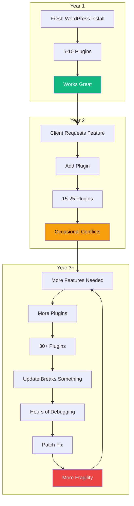
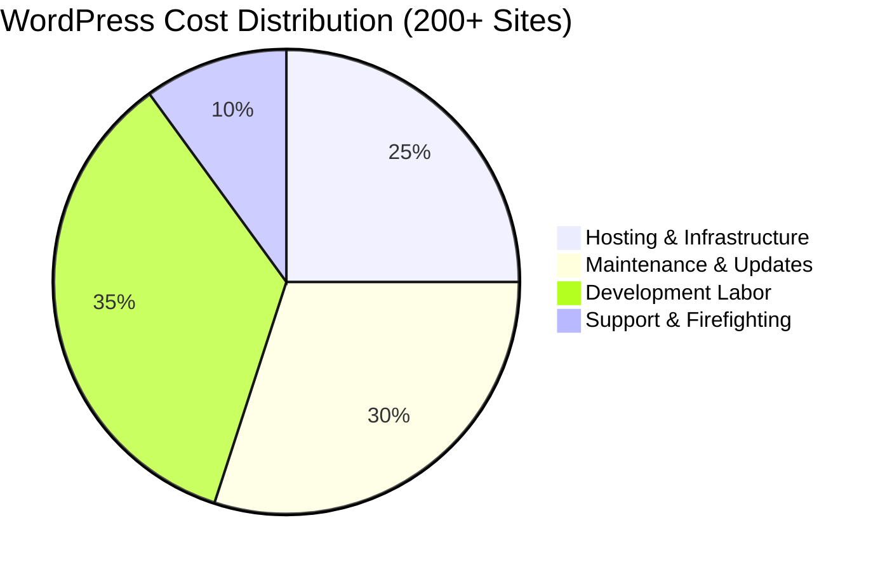
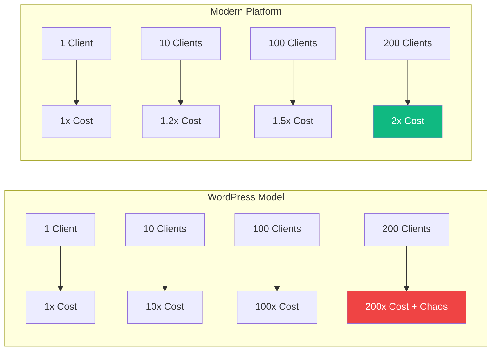
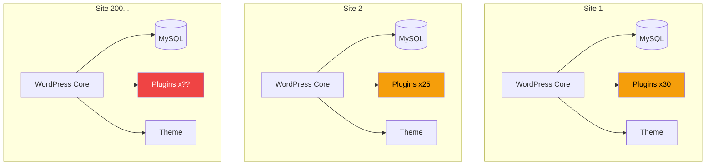
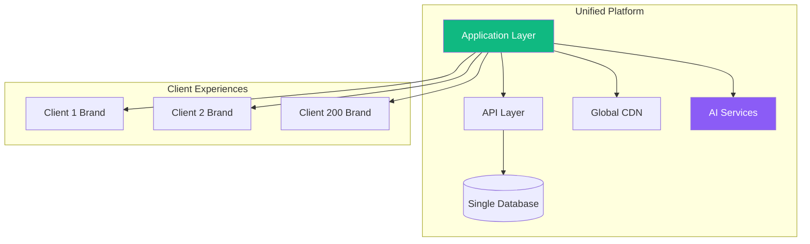
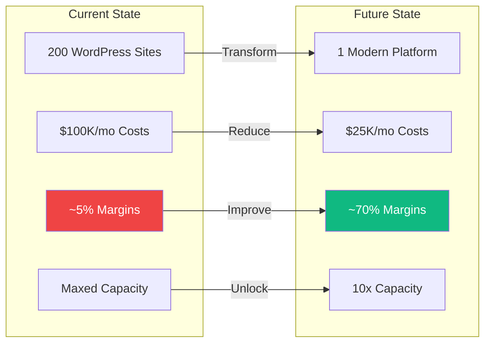

# WordPress vs. Modern Platform Architecture

> An honest assessment of why WordPress served its purpose—and why it's time to evolve

---

## Understanding WordPress: A Product of Its Time

WordPress was revolutionary when it launched in 2003. The web was a different place:

- **Hosting was complex**: Setting up a website required server administration skills
- **Code was inaccessible**: Building anything required deep technical knowledge
- **Tools were fragmented**: Databases, file systems, and frontends were separate concerns
- **Content management didn't exist**: Most sites were static HTML files

WordPress solved a real problem: it unified everything under one roof. Database, file management, content editing, themes, plugins—all accessible through a single interface. For individuals and small businesses, this was transformative.

**WordPress democratized web publishing.** That contribution to the internet's history is significant and shouldn't be dismissed.

---

## The Agency Problem WordPress Was Never Meant to Solve

Here's what WordPress was designed for:
- A blogger publishing articles
- A small business with a simple website
- A freelancer managing a few client sites

Here's what WordPress was **never designed for**:
- An agency managing 200+ client sites
- A platform requiring consistent design systems at scale
- A business model where maintenance margins matter
- An operation that needs to grow without proportional headcount

WordPress became an agency tool by accident, not by design. And when you push any tool beyond its intended use, the cracks show.

---

## The Compounding Complexity Problem

### How WordPress Degrades Over Time

### The Plugin Paradox

Every plugin you add to WordPress:

| Action | Immediate Effect | Long-term Effect |
|--------|------------------|------------------|
| Add functionality | Feature works | Dependency created |
| Update plugin | Bug fixed | Potential conflicts |
| Update WordPress core | Security patched | Plugin compatibility unknown |
| Add another plugin | More capability | Exponential complexity |
| Client requests change | Quick fix available | Technical debt accumulates |

**The math is brutal**: If you have 30 plugins and each has a 5% chance of conflict per update, you're almost guaranteed issues with every maintenance cycle.

---

## The Hidden Economics of WordPress at Scale

### Where the $100K/Month Goes

### The Maintenance Tax

| Activity | What It Should Cost | What WordPress Costs | Overhead |
|----------|--------------------|--------------------|----------|
| Plugin updates (200 sites) | Automated, $0 | 20+ hours/week | $4K+/mo |
| Security monitoring | Automated, minimal | Constant vigilance | $3K+/mo |
| Conflict resolution | Shouldn't exist | Weekly occurrence | $5K+/mo |
| Performance optimization | One-time setup | Ongoing battle | $2K+/mo |
| Client support for simple changes | Self-service | Manual, every time | $3K+/mo |

**The painful truth**: More hours are spent maintaining WordPress than actually building new features or serving clients.

---

## Why WordPress Can't Scale an Agency

### The Linear Cost Problem

### WordPress: Every Client is an Island

| With WordPress | Reality |
|----------------|---------|
| Each client = separate installation | 200 codebases to maintain |
| Each site = unique plugin combination | 200 different potential failure points |
| Each update = site-specific risk | 200 update cycles per month |
| Each support request = custom context | No leverage, no patterns |

### Modern Platform: Clients Share Infrastructure

| With Modern Architecture | Reality |
|--------------------------|---------|
| All clients = one codebase | Update once, deploy everywhere |
| Shared component library | Consistency without effort |
| Unified deployment | One process, all sites |
| Common patterns | Support becomes systematic |

---

## The Architecture Comparison

### WordPress Architecture (Web 2.0 Era)

**Problems visible in the architecture:**
- No shared resources
- Duplicated infrastructure
- Inconsistent plugin sets
- No central control
- No economies of scale

### Modern Multi-Tenant Architecture

**Advantages visible in the architecture:**
- Shared infrastructure
- Single codebase
- Consistent experience
- Central updates
- Massive economies of scale

---

## The Philosophical Shift

### WordPress Thinking
> "How do we make this client's WordPress site work?"

Every problem is solved site-by-site. Every solution is custom. Every hour spent is specific to one client.

### Platform Thinking
> "How do we make our platform better for all clients?"

Every improvement benefits everyone. Every hour invested creates leverage. The platform gets better with scale, not worse.

---

## What Modern Architecture Enables

| Capability | WordPress Reality | Modern Platform Reality |
|------------|-------------------|------------------------|
| **Design Consistency** | Fight for it constantly | Enforced automatically |
| **Updates** | 200 separate processes | One deployment |
| **New Features** | Build 200 times | Build once, available everywhere |
| **Client Self-Service** | Limited, risky | Native, safe |
| **AI Integration** | Bolted on, fragile | Built-in, powerful |
| **Performance** | Site-by-site optimization | Platform-level optimization |
| **Security** | 200 attack surfaces | One hardened surface |
| **Scaling** | Linear cost growth | Logarithmic cost growth |

---

## The Path Forward

This isn't about WordPress being "bad." WordPress did exactly what it was designed to do. It brought millions of people onto the web. It created an ecosystem that changed publishing forever.

But WordPress was designed for a different era and a different use case. Using it to run a 200+ site agency operation is like using a bicycle to run a delivery company—it worked when you had 5 deliveries, but it breaks down at 200.

### What Transformation Looks Like

### The Honest Assessment

| Aspect | WordPress | Modern Platform |
|--------|-----------|-----------------|
| Learning curve | Lower initially | Higher initially |
| Time to first site | Faster | Slower (platform build) |
| Time to 200th site | Same as first | Nearly instant |
| Maintenance at scale | Unsustainable | Trivial |
| Long-term costs | Grow linearly | Grow logarithmically |
| Design quality at scale | Degrades | Improves |
| Team stress | Increases with scale | Decreases with scale |

---

## Conclusion

WordPress served the web well. It brought publishing to the masses. It created opportunities for millions.

But the web has evolved. Client expectations have evolved. The economics of running an agency have evolved.

Continuing to push WordPress beyond its design limits isn't a WordPress problem—it's a strategic problem. The platform was never meant to be an enterprise agency tool, and forcing it into that role costs more in maintenance than it returns in value.

The path forward is clear: build a platform designed for scale, designed for consistency, designed for the economics of a modern agency. Then let WordPress retire with dignity to the use case it was always meant for—simple sites for simple needs.

---

*Document Prepared: January 2026*
*Light Brand Consulting — Building What's Next*
