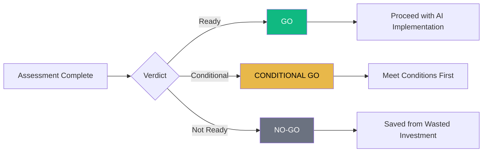
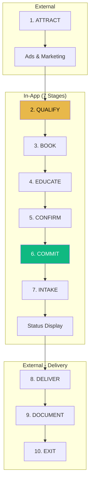
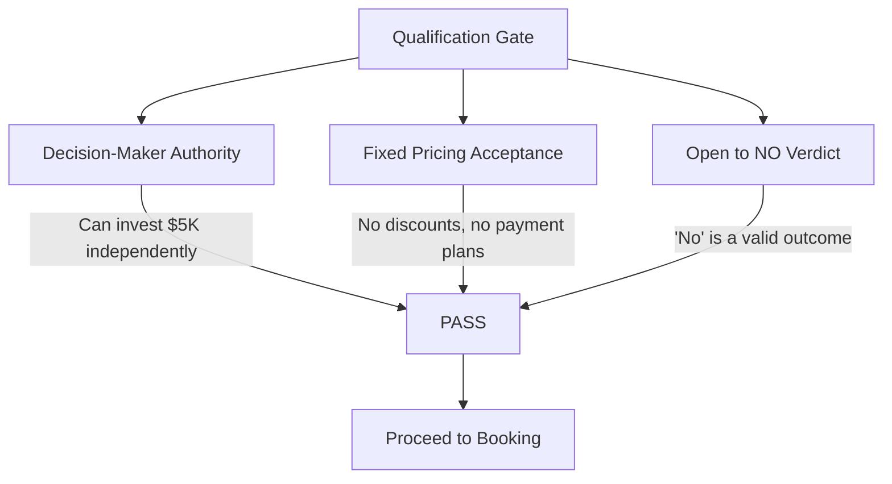

# AI Go/No-Go Assessment - Overview

## Executive Summary

The AI Go/No-Go Assessment is a premium consulting product ($5,000 fixed fee) that delivers a clear verdict on whether AI makes sense for a business. The system implements a 10-stage funnel strategy, with 7 stages handled in-app and 3 stages (Attract, Deliver, Document) handled externally.

## Business Model

### Product Definition
- **Name**: AI Go/No-Go Assessment™
- **Price**: $5,000 (fixed, non-negotiable)
- **Value Proposition**: "We sell judgment, not AI. A 'no' verdict constitutes successful completion."

### Verdict Types

| Verdict | Meaning | Client Outcome |
|---------|---------|----------------|
| **GO** | AI makes sense now | Proceed with confidence |
| **CONDITIONAL GO** | Could work with conditions | Meet specific requirements first |
| **NO-GO** | Not the right move now | Protected from wasted investment |

## Funnel Strategy (10 Stages)

### Stage Breakdown

| # | Stage | Purpose | Implementation |
|---|-------|---------|----------------|
| 1 | **ATTRACT** | Drive traffic | External (ads/marketing) |
| 2 | **QUALIFY** | Self-qualification | `AssessmentQualifyStage.tsx` |
| 3 | **BOOK** | Schedule call | `AssessmentBookStage.tsx` |
| 4 | **EDUCATE** | VSL viewing | `AssessmentEducateStage.tsx` |
| 5 | **CONFIRM** | Review booking | `AssessmentConfirmStage.tsx` |
| 6 | **COMMIT** | Payment ($5K) | `AssessmentCommitStage.tsx` |
| 7 | **INTAKE** | Questionnaire + Loom | `AssessmentIntakeStage.tsx` |
| 8 | **DELIVER** | Verdict call | External (live call) |
| 9 | **DOCUMENT** | One-page report | External (PDF delivery) |
| 10 | **EXIT** | Clean exit | Status page / completion |

## Qualification Criteria

Three mandatory checkboxes that must ALL be confirmed:

### Disqualification Messaging

**NOT For:**
- AI beginners needing education
- Tool shoppers wanting recommendations
- Implementation seekers expecting hands-on help
- "How do I use AI?" buyers
- Businesses with no traction
- Discount or payment plan seekers

**IS For:**
- Decision-makers with budget authority
- Those accepting fixed pricing
- People open to hearing "no"
- Businesses with real traction
- Those who value expert judgment

## Enforcement Rules

### VSL Requirement
- Must watch **90%** of the video to proceed
- Progress tracked in real-time
- Button disabled until threshold met
- Enforced by `AssessmentEducateStage.tsx`

### Loom Video Requirement
- **Mandatory** Loom walkthrough of business
- 5-10 minutes demonstrating operations
- Valid Loom URL required to submit intake
- "No video = no assessment"

### Payment Before Intake
- Payment collected via Stripe Checkout
- Intake stage only accessible after payment confirmed
- Webhook updates database on successful payment

## Intake Questions (13 Total)

The intake questionnaire covers four key assessment dimensions:

### 1. Business Context
- Business overview
- Decision codification
- Founder concentration

### 2. Operational Structure
- Current operational systems
- **Documentation level assessment** (5-point scale)
- Scalability readiness

### 3. AI Readiness
- Current AI usage
- AI expectations

### 4. Constraints & Context
- Biggest constraint
- Team structure
- Revenue range
- Timeline/urgency
- Additional context

### Documentation Level Scale
1. Not documented - Everything is in my head
2. Minimally documented - Some notes and checklists exist
3. Partially documented - Key processes are written down
4. Well documented - Most processes have SOPs
5. Fully documented - Comprehensive documentation with regular updates

## Success Metrics

The assessment success is measured by:

1. **Funnel Completion Rate**: Qualify → Paid conversion
2. **VSL Watch Rate**: Average watch percentage
3. **Intake Completion Rate**: Paid → Intake submitted
4. **Verdict Distribution**: GO / CONDITIONAL / NO-GO ratio
5. **Client Satisfaction**: Post-verdict feedback

## Refund Policy

> "This is a judgment-based service. A 'NO-GO' verdict protects you from wasted AI investment. No refunds based on verdict outcome."

The NO-GO verdict IS the service - it saves clients from making bad AI investments.
