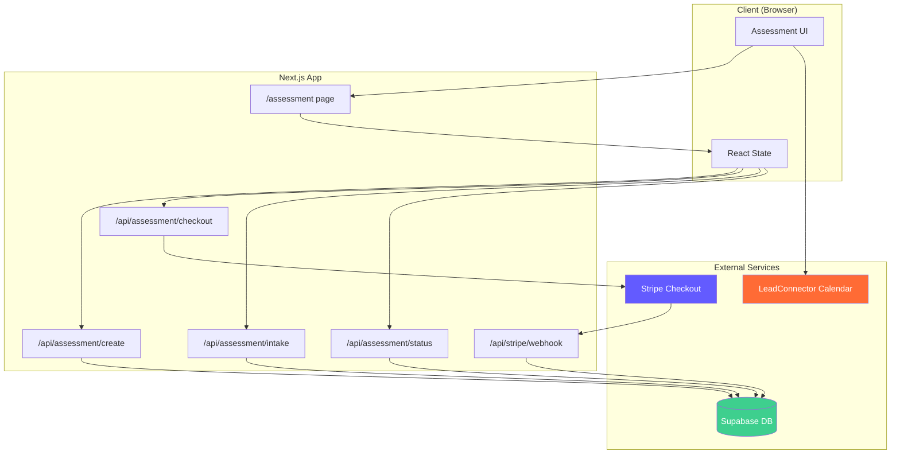
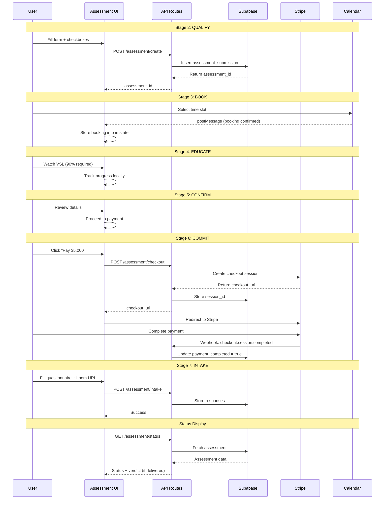
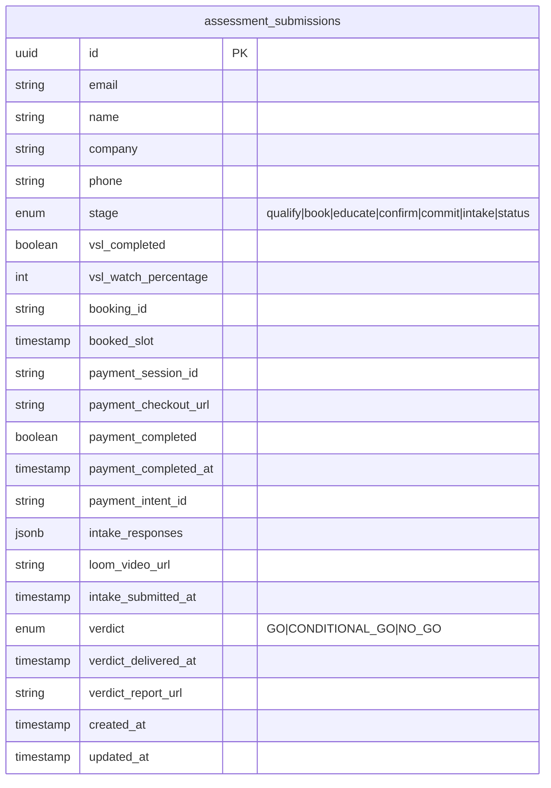
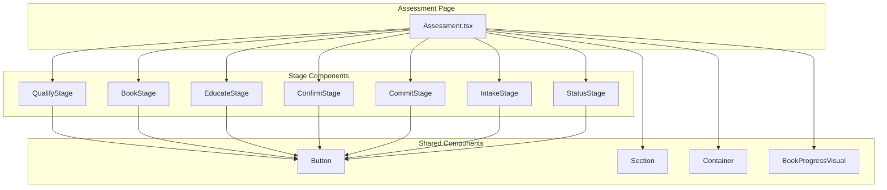
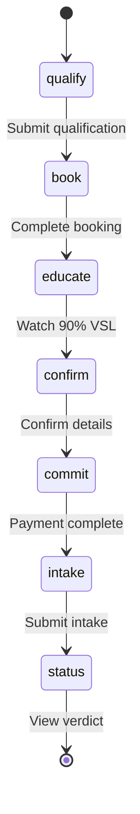

# AI Go/No-Go Assessment - Architecture

## System Architecture



## File Structure

```
src/
├── app/
│   ├── assessment/
│   │   └── page.tsx                    # Route entry point
│   └── api/
│       ├── assessment/
│       │   ├── create/route.ts         # Create new assessment
│       │   ├── checkout/route.ts       # Stripe checkout session
│       │   ├── intake/route.ts         # Submit intake responses
│       │   └── status/route.ts         # Get assessment status
│       └── stripe/
│           └── webhook/route.ts        # Stripe webhook handler
│
├── page-components/
│   └── Assessment.tsx                  # Main page component
│
├── components/
│   └── assessment/
│       ├── index.ts                    # Barrel exports
│       ├── AssessmentQualifyStage.tsx  # Stage 2: Qualification
│       ├── AssessmentBookStage.tsx     # Stage 3: Calendar booking
│       ├── AssessmentEducateStage.tsx  # Stage 4: VSL viewing
│       ├── AssessmentConfirmStage.tsx  # Stage 5: Confirmation
│       ├── AssessmentCommitStage.tsx   # Stage 6: Payment
│       ├── AssessmentIntakeStage.tsx   # Stage 7: Questionnaire
│       └── AssessmentStatusStage.tsx   # Stages 8-10: Status/Verdict
│
├── lib/
│   ├── constants.ts                    # ASSESSMENT_CONFIG, INTAKE_QUESTIONS
│   └── stripe.ts                       # createAssessmentCheckout helper
│
└── types/
    ├── index.ts                        # AssessmentFormData, AssessmentStage
    └── database.ts                     # AssessmentSubmission types
```

## Data Flow

### Stage Progression



## Database Schema

### assessment_submissions Table



### TypeScript Types

```typescript
// Assessment Stages
type AssessmentStage =
  | 'qualify'   // Landing/self-qualification
  | 'book'      // Calendar booking
  | 'educate'   // VSL video viewing
  | 'confirm'   // Booking confirmation
  | 'commit'    // Payment ($5,000)
  | 'intake'    // Questionnaire + Loom
  | 'status';   // Assessment status/confirmation

// Verdict Types
type AssessmentVerdict = 'GO' | 'CONDITIONAL_GO' | 'NO_GO' | null;

// Form Data (Client State)
interface AssessmentFormData {
  // Contact info
  name?: string;
  email?: string;
  company?: string;
  phone?: string;

  // Qualification
  isDecisionMaker?: boolean;
  acceptsFixedPricing?: boolean;
  openToNegativeVerdict?: boolean;

  // VSL tracking
  vslStartedAt?: Date;
  vslCompletedAt?: Date;
  vslWatchPercentage?: number;

  // Booking
  bookingId?: string;
  bookedSlot?: Date;
  bookingConfirmed?: boolean;

  // Payment
  paymentSessionId?: string;
  paymentCompleted?: boolean;
  paymentCompletedAt?: Date;

  // Intake
  intakeResponses?: Record<string, string>;
  loomVideoUrl?: string;
  intakeSubmittedAt?: Date;

  // Assessment
  assessmentId?: string;
  verdict?: AssessmentVerdict;
  verdictDeliveredAt?: Date;
}
```

## Component Architecture



## State Management

The assessment uses React's built-in state management with `useState` and `useCallback`:



### State Updates

| Action | State Change | Side Effect |
|--------|-------------|-------------|
| Submit Qualify | `stage: 'book'`, store contact info | POST /assessment/create |
| Complete Booking | `stage: 'educate'`, store booking info | - |
| Watch VSL | `stage: 'confirm'`, store watch % | - |
| Confirm | `stage: 'commit'` | - |
| Pay | `stage: 'intake'` | POST /assessment/checkout → Stripe |
| Submit Intake | `stage: 'status'` | POST /assessment/intake |

## Security Considerations

1. **Payment Security**: All payments processed via Stripe Checkout (PCI compliant)
2. **Webhook Verification**: Stripe webhook signatures verified before processing
3. **Database Access**: Supabase admin client used server-side only
4. **Type Safety**: TypeScript types enforce data integrity
5. **Input Validation**: Server-side validation on all API routes
