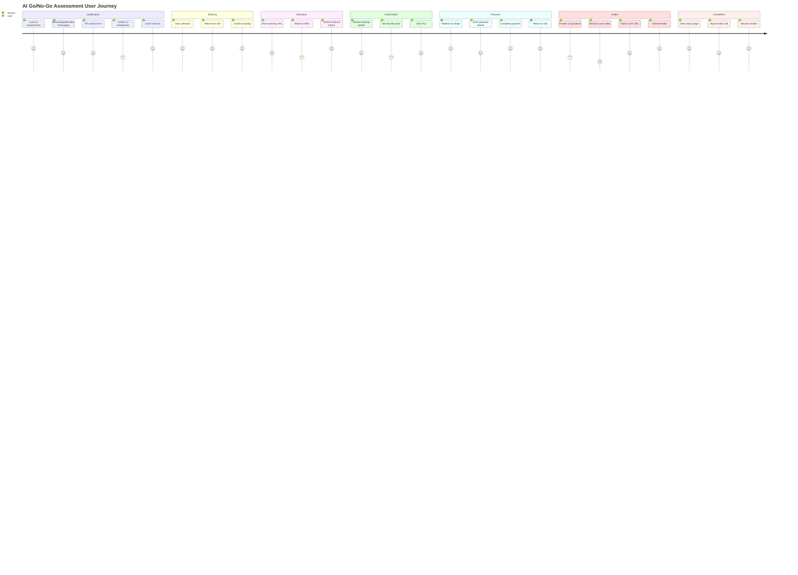
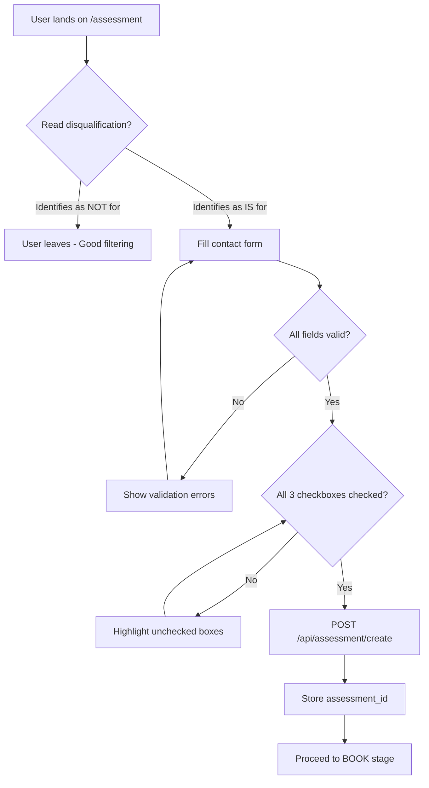
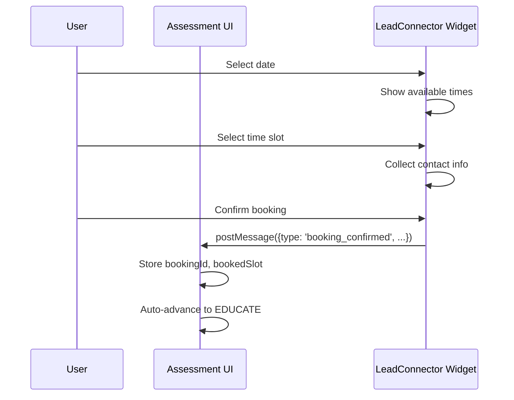
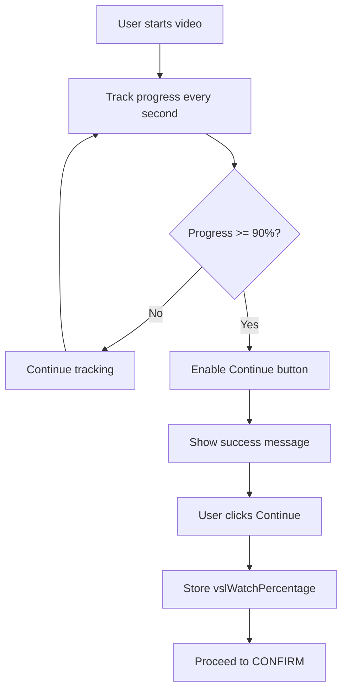
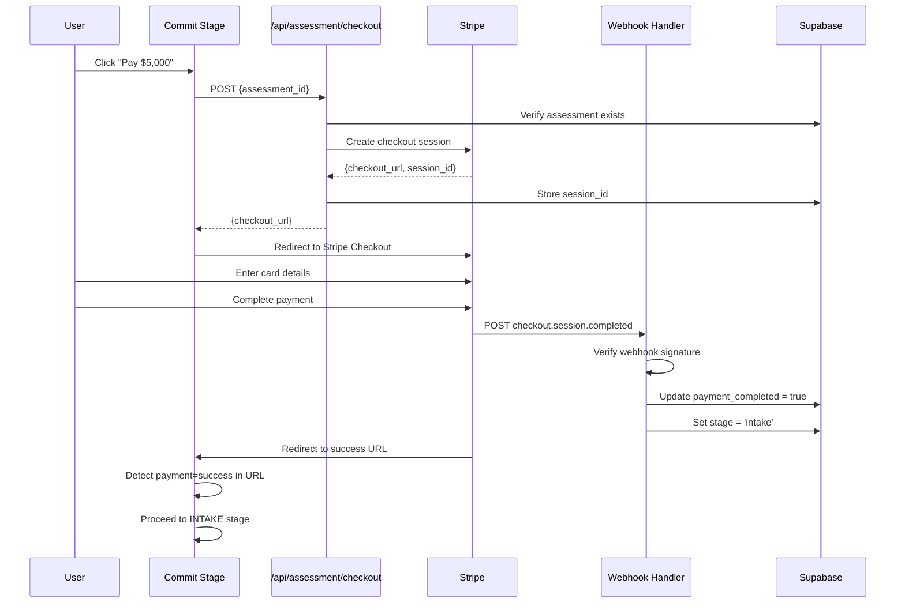
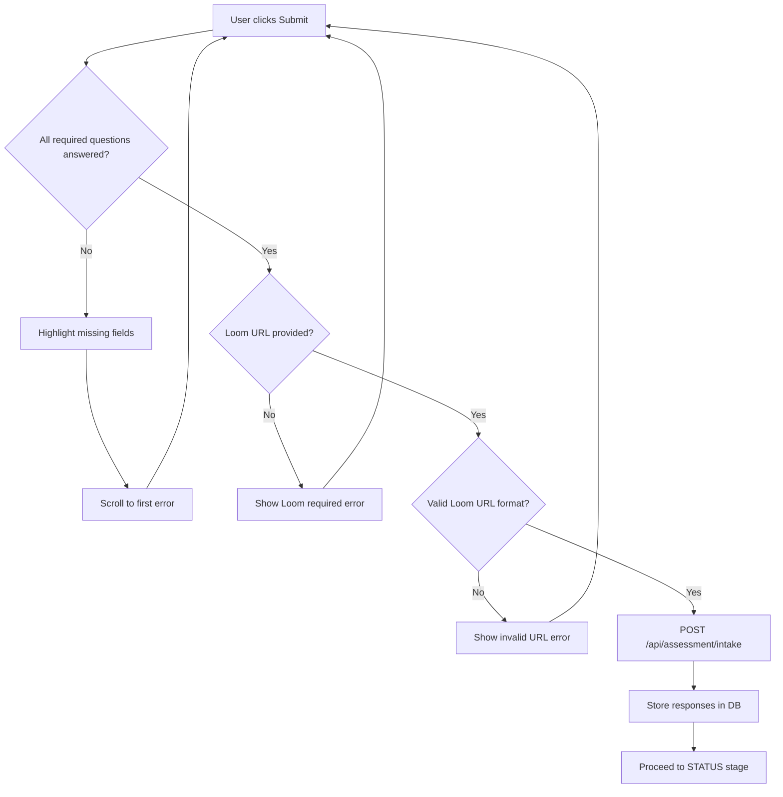
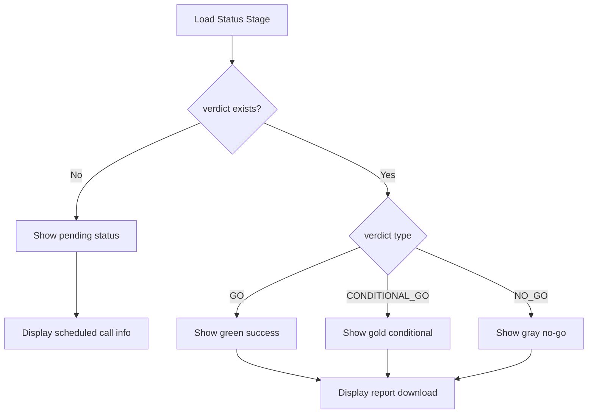

# AI Go/No-Go Assessment - User Flow

## Complete User Journey



---

## Stage 1: QUALIFY

### Purpose
Force self-qualification through transparent disqualification messaging and mandatory checkboxes.

### UI Components

```
┌─────────────────────────────────────────────────────────┐
│                AI Go/No-Go Assessment™                   │
│                   $5,000 Fixed Fee                       │
│  "A clear yes/no decision on whether AI makes sense..."  │
├─────────────────────────┬───────────────────────────────┤
│  ✗ NOT for you if:      │  ✓ IS for you if:             │
│  • AI beginners         │  • Decision-maker              │
│  • Tool shoppers        │  • Accept fixed pricing        │
│  • Implementation...    │  • Open to "no" verdict        │
│  • "How do I use AI"    │  • Real business traction      │
│  • No traction          │  • Value expert judgment       │
│  • Discount seekers     │                                │
├─────────────────────────┴───────────────────────────────┤
│  Ready to proceed? Enter your details.                   │
│  ┌─────────────────────────────────────────────────┐    │
│  │ Full Name *                                      │    │
│  │ [____________________________________]          │    │
│  │                                                  │    │
│  │ Email Address *                                  │    │
│  │ [____________________________________]          │    │
│  │                                                  │    │
│  │ Company Name          Phone Number               │    │
│  │ [________________]    [________________]        │    │
│  └─────────────────────────────────────────────────┘    │
│                                                          │
│  Confirm your eligibility:                               │
│  ┌────────────────────────────────────────────────────┐ │
│  │ ☐ I am a decision-maker with authority to invest   │ │
│  │   $5,000 without requiring additional approval.    │ │
│  └────────────────────────────────────────────────────┘ │
│  ┌────────────────────────────────────────────────────┐ │
│  │ ☐ I understand and accept the fixed $5,000 fee.    │ │
│  │   No discounts. No payment plans.                  │ │
│  └────────────────────────────────────────────────────┘ │
│  ┌────────────────────────────────────────────────────┐ │
│  │ ☐ I am open to receiving a "NO-GO" verdict.        │ │
│  │   I understand that a "no" saves me from waste.    │ │
│  └────────────────────────────────────────────────────┘ │
│                                                          │
│          [  Continue to Schedule Call  ]                 │
│                                                          │
│  After scheduling, you'll watch a short video...         │
└─────────────────────────────────────────────────────────┘
```

### Flow Diagram



### Validation Rules
- Name: Required, non-empty
- Email: Required, valid email format
- All three checkboxes: Must be checked

---

## Stage 2: BOOK

### Purpose
Schedule the verdict call using LeadConnector group calendar (without showing price).

### UI Components

```
┌─────────────────────────────────────────────────────────┐
│           Schedule Your Assessment Call                  │
│  Select a time for your AI Go/No-Go Assessment verdict   │
│  call. This is where you'll receive your decision.       │
├─────────────────────────────────────────────────────────┤
│  ┌─────────────────────────────────────────────────┐    │
│  │                                                  │    │
│  │         [LeadConnector Calendar Widget]          │    │
│  │                                                  │    │
│  │              January 2026                        │    │
│  │    Su  Mo  Tu  We  Th  Fr  Sa                   │    │
│  │                 1   2   3   4                   │    │
│  │     5   6   7   8   9  10  11                   │    │
│  │    12  13  14  15  16  17  18                   │    │
│  │    19  20 [21] 22  23  24  25                   │    │
│  │    26  27  28  29  30  31                       │    │
│  │                                                  │    │
│  │         Available Times for Jan 21:             │    │
│  │         [ 9:00 AM ]  [ 10:30 AM ]              │    │
│  │         [ 2:00 PM ]  [ 3:30 PM ]               │    │
│  │                                                  │    │
│  └─────────────────────────────────────────────────┘    │
├─────────────────────────────────────────────────────────┤
│  ℹ️ What happens next:                                   │
│     1. Watch a mandatory video explaining the process    │
│     2. Confirm your booking after watching               │
│     3. Complete payment to secure your spot              │
│     4. Fill out your intake questionnaire                │
├─────────────────────────────────────────────────────────┤
│  [← Back]                              [Skip (Dev)]      │
└─────────────────────────────────────────────────────────┘
```

### Calendar Integration



---

## Stage 3: EDUCATE

### Purpose
Ensure the prospect fully understands the offering before committing payment through mandatory VSL viewing.

### UI Components

```
┌─────────────────────────────────────────────────────────┐
│              Watch Before Your Call                      │
│  This video explains exactly what the AI Go/No-Go        │
│  Assessment delivers. You must watch at least 90%.       │
├─────────────────────────────────────────────────────────┤
│  ┌─────────────────────────────────────────────────┐    │
│  │                                                  │    │
│  │                                                  │    │
│  │              [Video Player]                      │    │
│  │                                                  │    │
│  │                   ▶                             │    │
│  │              Tap to play                         │    │
│  │           Duration: 15 minutes                   │    │
│  │                                                  │    │
│  │  ━━━━━━━━━━━━━━━━━━━━━━━━━━━━━━━━━━━━━━━━━━━━━  │    │
│  │  Progress: 67%                           │90%   │    │
│  │  ██████████████████████████░░░░░░░░░░░░░░│      │    │
│  └─────────────────────────────────────────────────┘    │
├─────────────────────────────────────────────────────────┤
│  ⚠️ Keep watching: You need to watch at least 90%        │
│     of this video before you can proceed.                │
├─────────────────────────────────────────────────────────┤
│  [← Back]                              [23% more]        │
│                                        (disabled)        │
└─────────────────────────────────────────────────────────┘

After 90% watched:

┌─────────────────────────────────────────────────────────┐
│  ✓ Video complete! You now understand what the AI        │
│    Go/No-Go Assessment delivers.                         │
├─────────────────────────────────────────────────────────┤
│  [← Back]                              [Continue →]      │
└─────────────────────────────────────────────────────────┘
```

### Progress Tracking



---

## Stage 4: CONFIRM

### Purpose
Final review of booking details before payment commitment.

### UI Components

```
┌─────────────────────────────────────────────────────────┐
│                    ✓                                     │
│           Confirm Your Assessment                        │
│      Review your details and proceed to payment.         │
├─────────────────────────────────────────────────────────┤
│  Your Assessment Details                                 │
│  ───────────────────────────────────────────────────    │
│  Name             John Smith                             │
│  ───────────────────────────────────────────────────    │
│  Email            john@company.com                       │
│  ───────────────────────────────────────────────────    │
│  Company          Acme Corp                              │
│  ───────────────────────────────────────────────────    │
│  Verdict Call     Wed, Jan 21 at 2:00 PM                │
│  ───────────────────────────────────────────────────    │
│  Investment                              $5,000          │
├─────────────────────────────────────────────────────────┤
│  What You're Getting                                     │
│  ✓ Clear Verdict: GO, CONDITIONAL GO, or NO-GO          │
│  ✓ Judgment Call: Live verdict delivery with context     │
│  ✓ One-Page Report: Documentation of your assessment     │
│  ✓ Clean Exit: No automatic upsells. Just clarity.       │
├─────────────────────────────────────────────────────────┤
│  ℹ️ Important: After payment, you'll complete a          │
│     questionnaire and record a Loom walkthrough.         │
│     Incomplete intake pauses your assessment.            │
├─────────────────────────────────────────────────────────┤
│  [← Back]                            [Pay $5,000 →]      │
└─────────────────────────────────────────────────────────┘
```

---

## Stage 5: COMMIT

### Purpose
Collect $5,000 payment via Stripe Checkout.

### Payment Flow



### UI Components

```
┌─────────────────────────────────────────────────────────┐
│              Secure Your Assessment                      │
│  Complete payment to begin intake. Your call is          │
│  scheduled for Jan 21.                                   │
├─────────────────────────────────────────────────────────┤
│                     INVESTMENT                           │
│                                                          │
│                     $5,000                               │
│                                                          │
│            One-time payment. No hidden fees.             │
│  ───────────────────────────────────────────────────    │
│  Includes:                                               │
│  ✓ AI readiness evaluation    ✓ Async intake review     │
│  ✓ Live verdict call          ✓ Assessment report       │
│  ───────────────────────────────────────────────────    │
│                                                          │
│              [    Pay $5,000    ]                        │
│                                                          │
│                 🔒 Secured by Stripe                     │
├─────────────────────────────────────────────────────────┤
│  ℹ️ Refund Policy: This is a judgment-based service.     │
│     A "NO-GO" verdict protects you from wasted AI        │
│     investment. No refunds based on verdict outcome.     │
├─────────────────────────────────────────────────────────┤
│  [← Back]                              [Skip (Dev)]      │
└─────────────────────────────────────────────────────────┘
```

---

## Stage 6: INTAKE

### Purpose
Collect detailed business information through questionnaire and mandatory Loom video.

### Questionnaire Sections

```mermaid
graph LR
    subgraph Business Context
        Q1[Business Overview]
        Q2[Decision Codification]
        Q3[Founder Concentration]
    end

    subgraph Operations
        Q4[Operational Structure]
        Q5[Documentation Level]
        Q6[Scalability Readiness]
    end

    subgraph AI Readiness
        Q7[Current AI Usage]
        Q8[AI Expectations]
    end

    subgraph Constraints
        Q9[Biggest Constraint]
        Q10[Team Structure]
        Q11[Revenue Range]
        Q12[Timeline]
        Q13[Additional Context]
    end

    Business Context --> Operations
    Operations --> AI Readiness
    AI Readiness --> Constraints
```

### UI Components

```
┌─────────────────────────────────────────────────────────┐
│              Complete Your Intake                        │
│  Answer thoroughly. Your responses inform your           │
│  assessment. Incomplete intake pauses your assessment.   │
├─────────────────────────────────────────────────────────┤
│  1. Describe your business in 2-3 sentences. *           │
│     Be specific about your core offering and target.     │
│     ┌─────────────────────────────────────────────┐     │
│     │                                             │     │
│     │                                             │     │
│     └─────────────────────────────────────────────┘     │
│                                                          │
│  2. What are the top 3 decisions you make repeatedly? *  │
│     Think about decisions that happen daily/weekly.      │
│     ┌─────────────────────────────────────────────┐     │
│     │                                             │     │
│     │                                             │     │
│     └─────────────────────────────────────────────┘     │
│                                                          │
│  ... (13 questions total) ...                            │
├─────────────────────────────────────────────────────────┤
│  🎬 Required: Loom Video                                 │
│                                                          │
│  Record a 5-10 min video walking through your business.  │
│  Show tools, explain workflows, demonstrate pain points. │
│  No video = no assessment.                               │
│                                                          │
│  Loom Share URL *                                        │
│  ┌─────────────────────────────────────────────────┐    │
│  │ https://www.loom.com/share/...                  │    │
│  └─────────────────────────────────────────────────┘    │
│                                                          │
│  Don't have Loom? Sign up for free                       │
├─────────────────────────────────────────────────────────┤
│              [    Submit Intake    ]                     │
│                                                          │
│  Your assessment will be reviewed and verdict call       │
│  will proceed as scheduled.                              │
└─────────────────────────────────────────────────────────┘
```

### Validation



---

## Stage 7: STATUS

### Purpose
Display assessment status and eventually the verdict.

### Pre-Verdict View

```
┌─────────────────────────────────────────────────────────┐
│                         ✓                                │
│                  Intake Complete                         │
│  Your intake is submitted. Assessment is being prepared. │
├─────────────────────────────────────────────────────────┤
│  Assessment Status                                       │
│  ┌─────────────────────────────────────────────────┐    │
│  │ ✓ Self-qualification complete                   │    │
│  │ ✓ VSL video watched                             │    │
│  │ ✓ Payment confirmed - $5,000                    │    │
│  │ ✓ Intake submitted                              │    │
│  │ ✓ Loom video submitted                          │    │
│  │ ⟳ Verdict call pending                          │    │
│  └─────────────────────────────────────────────────┘    │
├─────────────────────────────────────────────────────────┤
│  📅 Your Verdict Call                                    │
│     Wednesday, Jan 21 at 2:00 PM                         │
│     You'll get an email reminder 24 hours before.        │
├─────────────────────────────────────────────────────────┤
│  What to Expect                                          │
│  • We'll review your intake and Loom video before call   │
│  • The call delivers your GO, CONDITIONAL, or NO-GO      │
│  • You'll receive a one-page assessment report           │
│  • No automatic upsells. Clean exit with clarity.        │
├─────────────────────────────────────────────────────────┤
│  Questions? assessment@lightbrand.com                    │
│                                                          │
│              [Return to Home]                            │
└─────────────────────────────────────────────────────────┘
```

### Post-Verdict View (GO)

```
┌─────────────────────────────────────────────────────────┐
│                         ✓                                │
│                        GO                                │
│  AI makes sense for your business right now.             │
│  Proceed with confidence.                                │
│                                                          │
│  Delivered on Wed, Jan 21 at 2:30 PM                     │
├─────────────────────────────────────────────────────────┤
│  Your Assessment Report                                  │
│  Your one-page report documents the verdict and key      │
│  findings.                                               │
│                                                          │
│              [Download Report (PDF)]                     │
├─────────────────────────────────────────────────────────┤
│              [Return to Home]                            │
└─────────────────────────────────────────────────────────┘
```

### Verdict Display Logic


