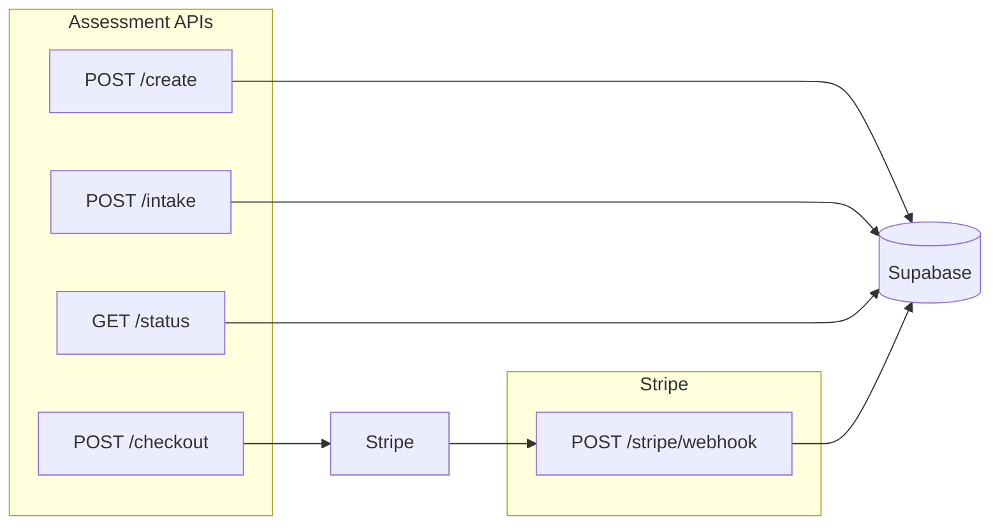
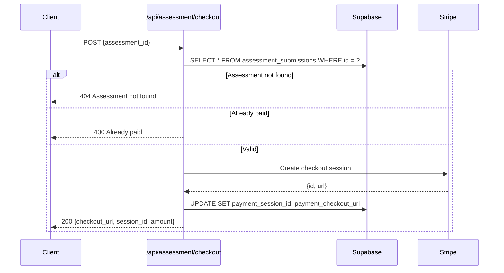
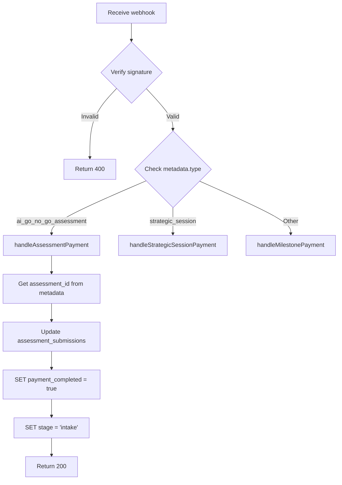

# AI Go/No-Go Assessment - API Reference

## Overview

All API routes are located under `/api/assessment/` with Stripe webhooks handled at `/api/stripe/webhook`.



---

## POST /api/assessment/create

Creates a new assessment submission when user completes qualification.

### Request

```typescript
POST /api/assessment/create
Content-Type: application/json

{
  "name": "John Smith",
  "email": "john@company.com",
  "company": "Acme Corp",        // optional
  "phone": "+1 555 123 4567"     // optional
}
```

### Response

```typescript
// Success (200)
{
  "id": "uuid-assessment-id",
  "message": "Assessment created successfully"
}

// Validation Error (400)
{
  "error": "Email is required"
}

// Server Error (500)
{
  "error": "Failed to create assessment"
}
```

### Database Operation

```sql
INSERT INTO assessment_submissions (
  id, email, name, company, phone, stage, created_at, updated_at
) VALUES (
  uuid_generate_v4(),
  'john@company.com',
  'John Smith',
  'Acme Corp',
  '+1 555 123 4567',
  'qualify',
  NOW(),
  NOW()
);
```

---

## POST /api/assessment/checkout

Creates a Stripe checkout session for the $5,000 assessment payment.

### Request

```typescript
POST /api/assessment/checkout
Content-Type: application/json

{
  "assessment_id": "uuid-assessment-id"
}
```

### Response

```typescript
// Success (200)
{
  "checkout_url": "https://checkout.stripe.com/c/pay/cs_xxx",
  "session_id": "cs_xxx",
  "amount": 5000
}

// Assessment Not Found (404)
{
  "error": "Assessment not found"
}

// Already Paid (400)
{
  "error": "Assessment has already been paid",
  "already_paid": true
}

// Stripe Not Configured (503)
{
  "error": "Payment system is not configured"
}

// Server Error (500)
{
  "error": "Failed to create checkout session"
}
```

### Flow Diagram



### Stripe Session Configuration

```typescript
stripe.checkout.sessions.create({
  payment_method_types: ['card'],
  line_items: [{
    price_data: {
      currency: 'usd',
      product_data: {
        name: 'AI Go/No-Go Assessment™',
        description: 'A clear yes/no decision on whether AI makes sense...',
        metadata: {
          assessment_id: assessmentId,
          type: 'ai_go_no_go_assessment',
        },
      },
      unit_amount: 500000, // $5,000 in cents
    },
    quantity: 1,
  }],
  mode: 'payment',
  success_url: `${baseUrl}/assessment?stage=intake&id=${assessment_id}&payment=success`,
  cancel_url: `${baseUrl}/assessment?stage=commit&id=${assessment_id}&payment=cancelled`,
  customer_email: assessment.email,
  metadata: {
    assessment_id: assessmentId,
    type: 'ai_go_no_go_assessment',
    client_name: assessment.name,
    company_name: assessment.company || '',
  },
});
```

---

## POST /api/assessment/intake

Submits the intake questionnaire responses and Loom video URL.

### Request

```typescript
POST /api/assessment/intake
Content-Type: application/json

{
  "assessment_id": "uuid-assessment-id",
  "responses": {
    "business_overview": "We are a SaaS company...",
    "decision_codification": "1. Lead qualification...",
    "founder_concentration": "high",
    "operational_structure": "We use HubSpot for CRM...",
    "documentation_level": "Partially documented - Key processes are written down",
    "scalability_readiness": "Our customer support would break...",
    "ai_current_usage": "ChatGPT for content...",
    "ai_expectations": "Automate lead scoring...",
    "biggest_constraint": "Time - I'm doing everything...",
    "team_structure": "4-10 team members",
    "revenue_range": "$500K - $1M",
    "timeline": "urgent",
    "additional_context": "We're preparing for Series A..."
  },
  "loom_url": "https://www.loom.com/share/abc123def456"
}
```

### Response

```typescript
// Success (200)
{
  "success": true,
  "message": "Intake submitted successfully"
}

// Validation Error (400)
{
  "error": "Loom video URL is required"
}

// Assessment Not Found (404)
{
  "error": "Assessment not found"
}

// Server Error (500)
{
  "error": "Failed to submit intake"
}
```

### Database Operation

```sql
UPDATE assessment_submissions
SET
  intake_responses = $responses::jsonb,
  loom_video_url = $loom_url,
  intake_submitted_at = NOW(),
  stage = 'status',
  updated_at = NOW()
WHERE id = $assessment_id;
```

---

## GET /api/assessment/status

Retrieves the current status of an assessment.

### Request

```typescript
GET /api/assessment/status?id=uuid-assessment-id
```

### Response

```typescript
// Success (200)
{
  "id": "uuid-assessment-id",
  "stage": "status",
  "name": "John Smith",
  "email": "john@company.com",
  "company": "Acme Corp",
  "booked_slot": "2026-01-21T14:00:00Z",
  "payment_completed": true,
  "intake_submitted_at": "2026-01-17T10:30:00Z",
  "verdict": null,                    // or "GO" | "CONDITIONAL_GO" | "NO_GO"
  "verdict_delivered_at": null,       // or ISO timestamp
  "verdict_report_url": null          // or URL to PDF
}

// Not Found (404)
{
  "error": "Assessment not found"
}
```

---

## POST /api/stripe/webhook

Handles Stripe webhook events for payment processing.

### Supported Events

| Event | Handler | Action |
|-------|---------|--------|
| `checkout.session.completed` | `handleAssessmentPayment` | Mark payment complete, advance to intake |
| `checkout.session.expired` | `handleCheckoutSessionExpired` | Clear expired session data |

### Webhook Signature Verification

```typescript
const event = stripe.webhooks.constructEvent(
  body,
  signature,
  process.env.STRIPE_WEBHOOK_SECRET
);
```

### checkout.session.completed Handler



### Database Update on Payment

```sql
UPDATE assessment_submissions
SET
  payment_completed = true,
  payment_completed_at = NOW(),
  payment_intent_id = $payment_intent,
  stage = 'intake',
  updated_at = NOW()
WHERE id = $assessment_id;
```

---

## Error Handling

### Standard Error Response Format

```typescript
interface ErrorResponse {
  error: string;
  details?: string;
  code?: string;
}
```

### HTTP Status Codes

| Code | Meaning | Use Case |
|------|---------|----------|
| 200 | Success | Request completed successfully |
| 400 | Bad Request | Validation error, missing required fields |
| 404 | Not Found | Assessment ID doesn't exist |
| 500 | Server Error | Database or external service failure |
| 503 | Service Unavailable | Stripe/Supabase not configured |

---

## Rate Limiting

Currently no rate limiting is implemented. Consider adding:

```typescript
// Recommended limits
const RATE_LIMITS = {
  '/api/assessment/create': '10 per hour per IP',
  '/api/assessment/checkout': '5 per hour per assessment',
  '/api/assessment/intake': '3 per hour per assessment',
};
```

---

## Webhook Security

### Required Headers

```
stripe-signature: t=timestamp,v1=signature
```

### Verification Process

1. Extract timestamp and signature from header
2. Construct signed payload: `${timestamp}.${body}`
3. Compute expected signature using HMAC-SHA256
4. Compare signatures (timing-safe comparison)
5. Verify timestamp is within tolerance (default: 5 minutes)

### Environment Variables

```bash
STRIPE_SECRET_KEY=sk_live_xxx
STRIPE_WEBHOOK_SECRET=whsec_xxx
```
