# The AI Intelligence Ecosystem

## Why Our System is Fundamentally Superior

Traditional consulting firms bill for **hours spent thinking**. We've inverted that model entirely.

We've taken **60+ years of combined human expertise** across three critical business domains and systematically encoded that intelligence into an organized AI superintelligence layer. The result: deliverables that would take traditional firms weeks or months, produced in hours or days—at a fraction of the cost.

---

## The Human Intelligence Foundation

### 60+ Years of Domain Mastery

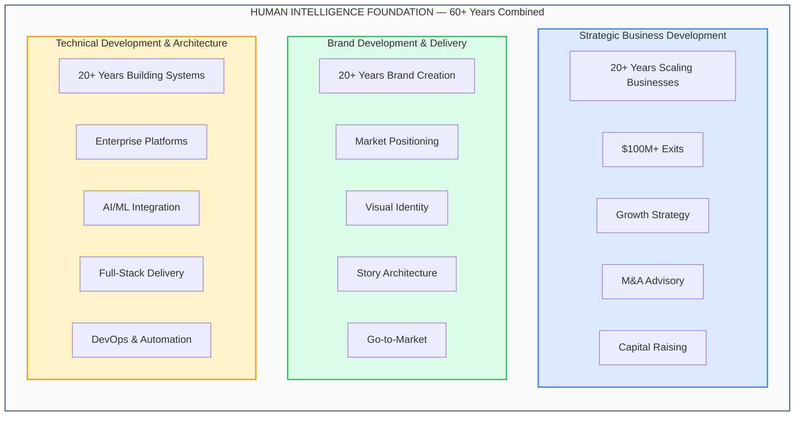

This isn't theoretical knowledge. It's **battle-tested wisdom** from:
- Building and exiting multiple companies
- Creating brands that define industries
- Architecting systems that handle millions of users
- Advising Fortune 500s and high-growth startups alike

---

## The Intelligence Flow Architecture

### From Inputs to Outputs: The Complete Flow

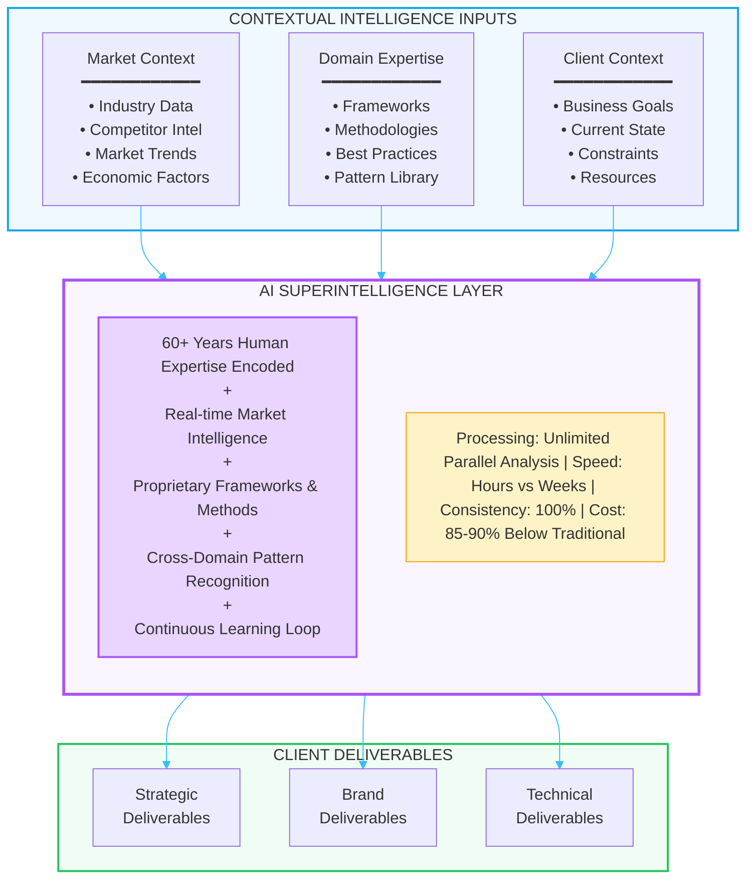

---

## The Complete Ecosystem View

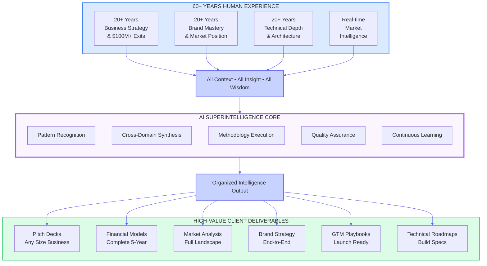

---

## What We Actually Deliver

### High-Value Strategic Documents

The same deliverables McKinsey, BCG, and Bain produce—but **faster and at a fraction of the cost**:

| Deliverable | Traditional Timeline | Traditional Cost | Our Timeline | Our Approach |
|-------------|---------------------|------------------|--------------|--------------|
| **Full Pitch Deck** | 2-4 weeks | $25,000-75,000 | 48-72 hours | Complete investor-ready deck |
| **Financial Model** | 3-6 weeks | $50,000-150,000 | 3-5 days | Full 3-5 year projections |
| **Market Analysis** | 4-8 weeks | $75,000-200,000 | 1 week | Comprehensive competitive landscape |
| **Go-to-Market Strategy** | 6-12 weeks | $100,000-300,000 | 1-2 weeks | Full GTM playbook |
| **Due Diligence Package** | 4-8 weeks | $50,000-150,000 | 1 week | Complete DD documentation |
| **Brand Strategy** | 6-12 weeks | $75,000-250,000 | 1-2 weeks | Full brand architecture |

### Complete Business Strategy Suite

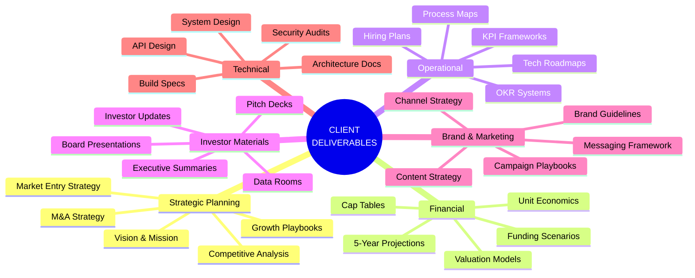

---

## The Consulting Firm Partnership Model

### We're Not Here to Replace You—We're Here to Amplify You

**For Consulting Firms: Your AI Intelligence Partner**

We understand the consulting business. We're not competing for your clients—we're positioning ourselves as your **trusted AI advisors**.

```mermaid
%%{init: {'theme': 'default', 'themeVariables': { 'primaryColor': '#e0f2fe', 'primaryTextColor': '#0c4a6e', 'lineColor': '#6366f1'}}}%%
flowchart LR
    subgraph yourfirm["YOUR FIRM"]
        direction TB
        y1["Client Relationships"]
        y2["Industry Expertise"]
        y3["Trust & Reputation"]
        y4["Strategic Advisory"]
        y5["Executive Access"]
    end

    subgraph ourcap["OUR CAPABILITIES"]
        direction TB
        o1["AI-Powered Speed"]
        o2["Scalable Execution"]
        o3["85% Cost Reduction"]
        o4["21x Faster Delivery"]
        o5["Consistent Quality"]
    end

    yourfirm --> combined
    ourcap --> combined

    subgraph combined["COMBINED OFFERING"]
        direction TB
        c1["Expand services without overhead"]
        c2["Win more deals with competitive pricing"]
        c3["Deliver faster without sacrificing quality"]
        c4["Scale capacity instantly"]
        c5["Access our entire book of business"]
    end

    style yourfirm fill:#dbeafe,stroke:#3b82f6,stroke-width:2px
    style ourcap fill:#dcfce7,stroke:#22c55e,stroke-width:2px
    style combined fill:#e9d5ff,stroke:#a855f7,stroke-width:3px
```

### Partnership Tiers

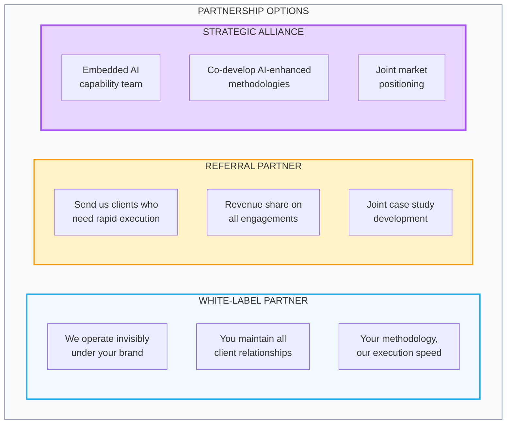

---

## The Multiplier Effect

### Why This Model Works

Traditional consulting is **linear**: more work = more hours = more cost.

Our model is **exponential**: the AI layer continuously learns and improves, making each engagement faster and better than the last.

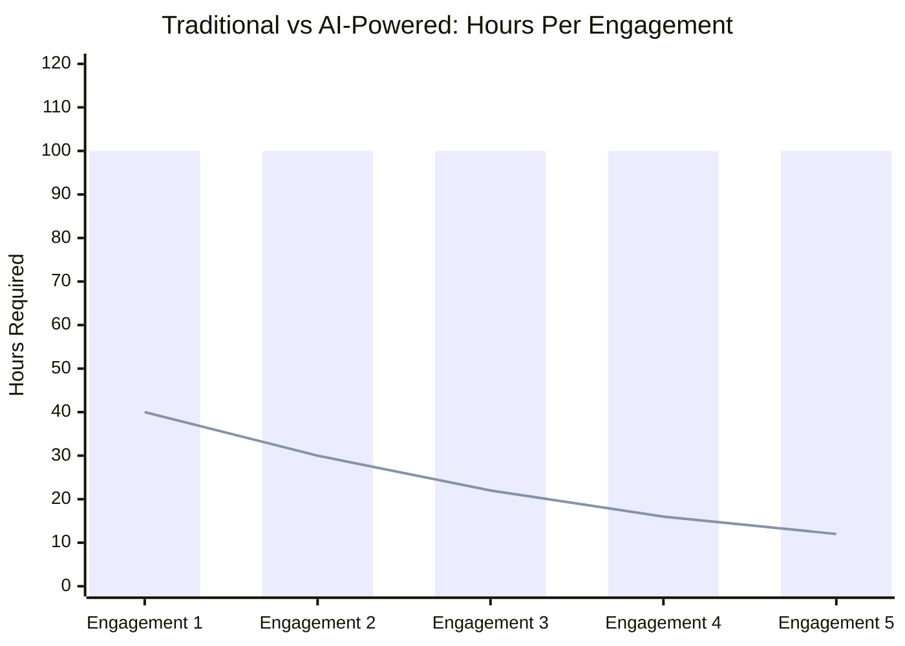

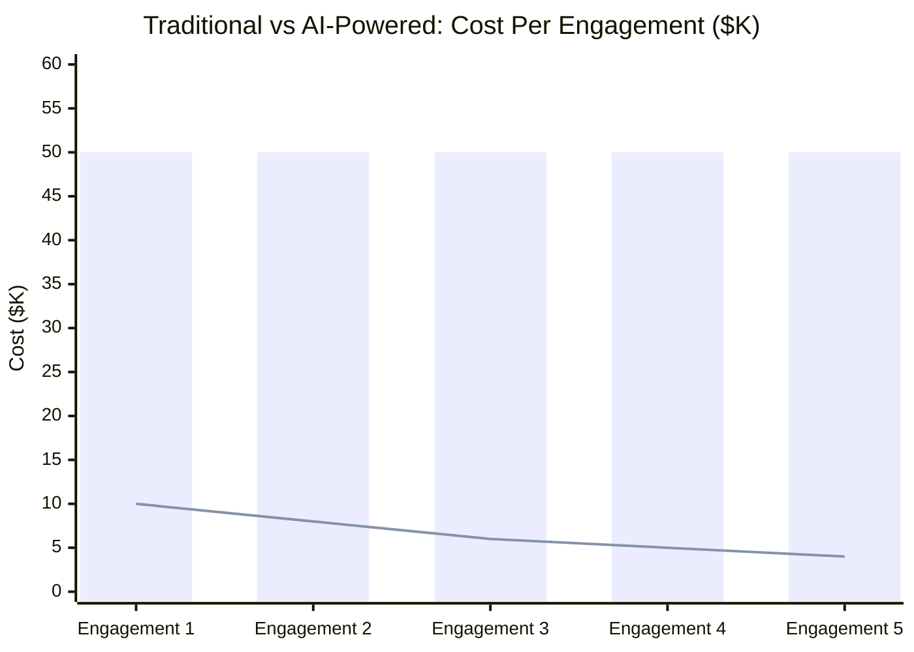

### The Compounding Advantage

```mermaid
%%{init: {'theme': 'default', 'themeVariables': { 'primaryColor': '#e0f2fe', 'primaryTextColor': '#0c4a6e', 'lineColor': '#6366f1'}}}%%
flowchart LR
    e1["Engagement 1"] --> learn1["Learning<br/>Captured"]
    learn1 --> e2["Engagement 2"]
    e2 --> learn2["Learning<br/>Compounds"]
    learn2 --> e3["Engagement 3"]
    e3 --> learn3["Patterns<br/>Recognized"]
    learn3 --> e4["Engagement 4"]
    e4 --> learn4["Efficiency<br/>Maximized"]

    subgraph result["RESULT"]
        r1["Each engagement<br/>improves the next"]
        r2["Costs decrease<br/>while quality increases"]
    end

    learn4 --> result

    style learn1 fill:#c7d2fe,stroke:#6366f1
    style learn2 fill:#a5b4fc,stroke:#6366f1
    style learn3 fill:#818cf8,stroke:#4f46e5,color:#fff
    style learn4 fill:#6366f1,stroke:#4f46e5,color:#fff
    style result fill:#dcfce7,stroke:#22c55e,stroke-width:2px
```

---

## Competitive Positioning

### Against Traditional Consulting Firms

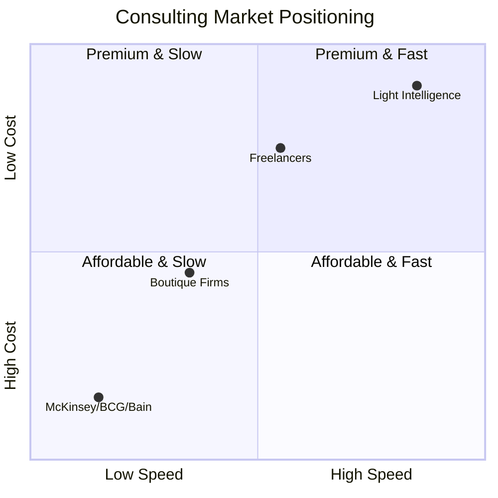

| Factor | McKinsey/BCG/Bain | Boutique Firms | Light Intelligence |
|--------|-------------------|----------------|-------------------|
| **Cost** | $500K-$2M+ | $100K-$500K | $10K-$50K |
| **Timeline** | 3-6 months | 1-3 months | 1-2 weeks |
| **Team Size** | 5-15 consultants | 2-5 consultants | AI + 1-2 humans |
| **Scalability** | Limited by headcount | Limited by headcount | Unlimited |
| **Consistency** | Varies by team | Varies by engagement | 100% methodology |
| **Availability** | Waitlist/competing priorities | Limited capacity | Immediate |

### Our Position: The Force Multiplier

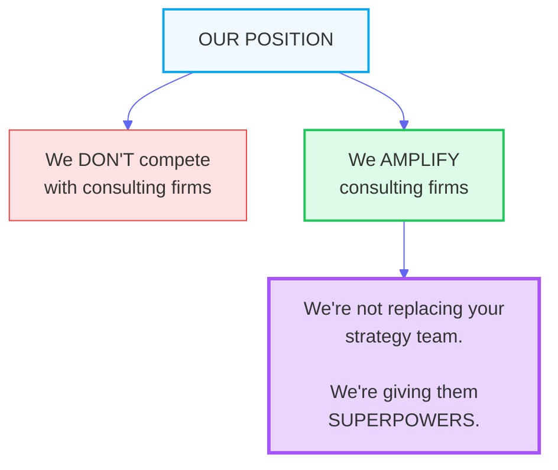

---

## The Value Proposition Summary

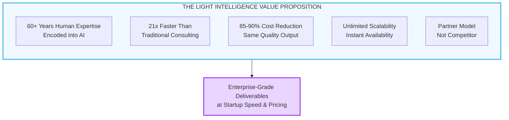

---

## The Call to Action

### For Businesses
Stop paying for consultants to think. Pay for results.

### For Consulting Firms
Stop turning away work due to capacity constraints. Partner with us.

### For Everyone
The future of consulting isn't human vs. AI. It's **human intelligence, amplified by AI, delivered at scale**.

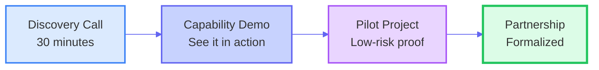

---

*This document represents the Light Consulting AI Intelligence Ecosystem—where 60+ years of human expertise meets unlimited AI capability to deliver consulting-grade results at startup speed.*
